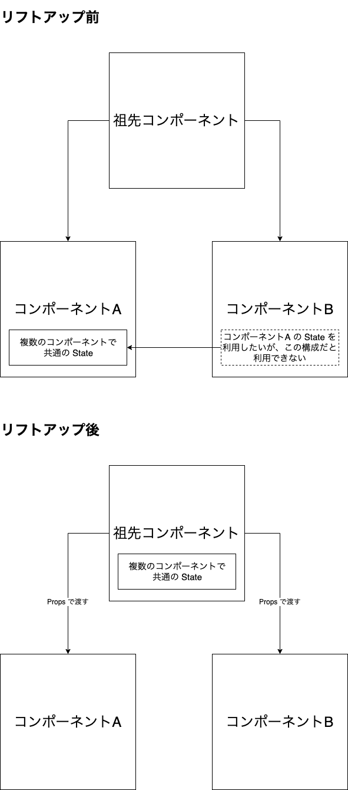

# [A React Lift State Up & Down Example](https://www.robinwieruch.de/react-lift-state)

## Lift Up（リフトアップ）とは

複数のコンポーネントで共通の State を利用したい場合、その State をコンポーネントの共通祖先のコンポーネントに持たせること。

## Lift Down（リフトダウン）とは

親コンポーネント自体では利用されておらず、１つのコンポーネントでのみ利用している State を、そのコンポーネントに持たせること。
